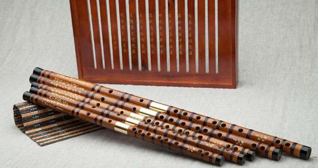
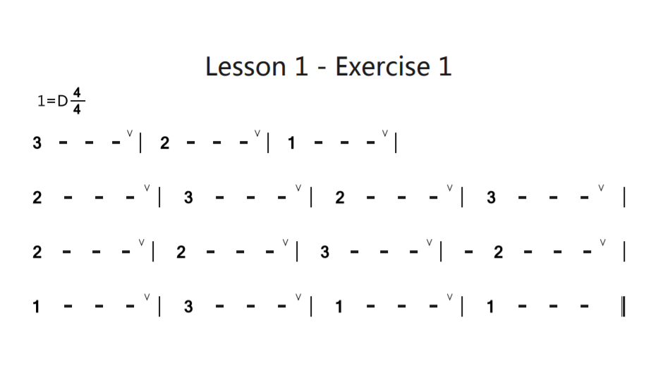
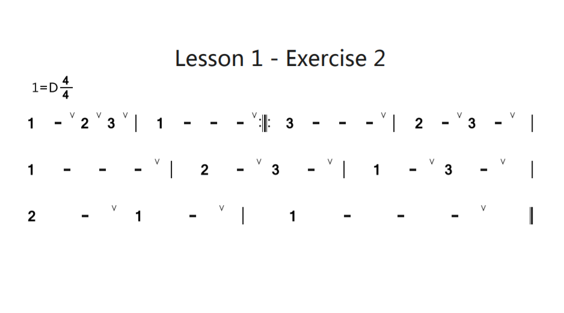
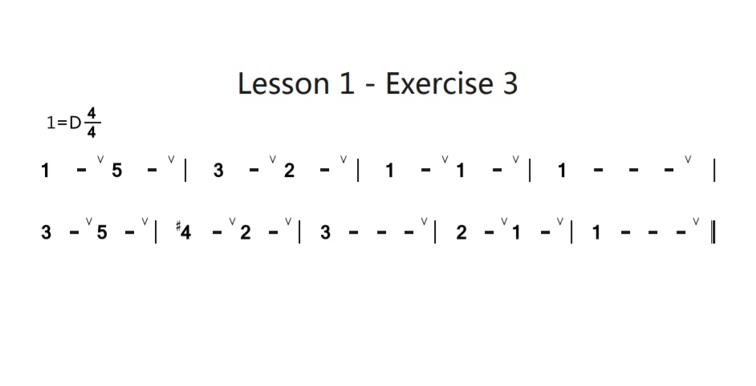
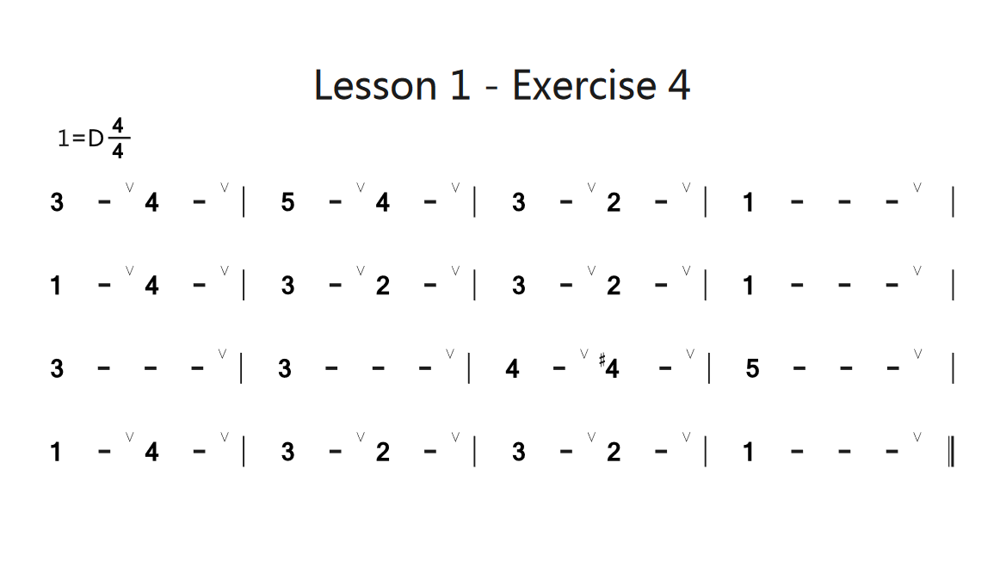
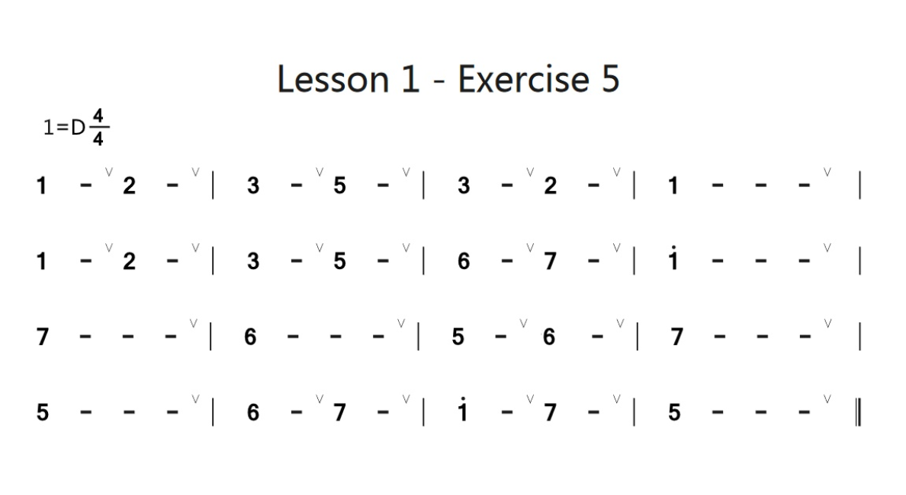
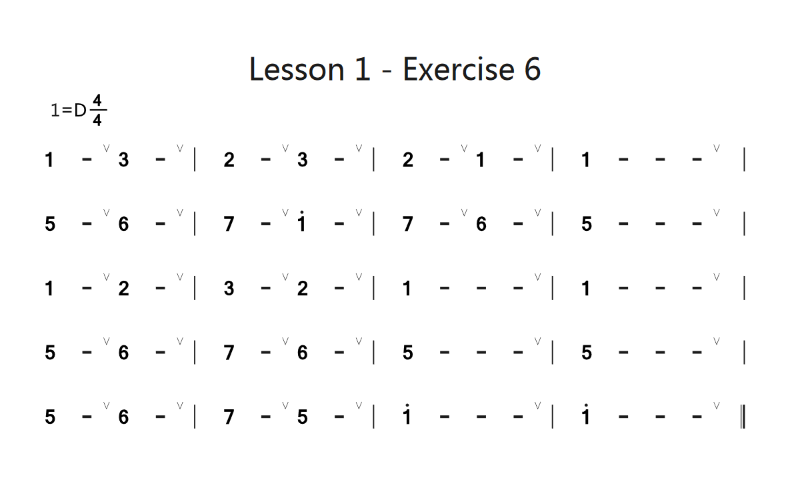

# Beginner's Guide to Dizi

**LESSON 2 AND ONWARDS YET TO COME**

A beginner’s guide to Chinese flute.

This guide assumes the reader is a beginner to dizi, however, it'll be helpful if you:

- have basic music theory
- played at least one instrument to some degree before
- know some Chinese (all Chinese terms will be translated, although it's not official)
- are willing to learn or already know how to read jianpu (numbered musical notation)

You should have or planning to buy:

- a flute
- dimo
- erjiao (special type of adhesive)
- a dimo protector (recommended)
- a dizi bag or case (recommended)
- a flute cleaner or a very thin stick roughly 30-40cm long (recommended)
- a thin microfibre cloth to clean the flute (recommended)

Disclaimer: if there are any mistakes in this guide, please message me. I am not a professional flute player or teacher. This serves as a hub for me to accumulate and translate resources for dizi for an English-speaking audience.

---

# Table of Contents

**[Introduction to Dizi](#introduction-to-dizi)**

**[Choosing Dizi](#choosing-dizi)**

[Materials of Dizi](#materials-of-dizi)

[Dizi Care](#dizi-care)

**[Dizi Basics](#dizi-basics)**

[Dimo](#dimo)

[Dizi Tones](#dizi-tones)

[Dizi Fingering](#dizi-fingering)

- [Base tone = 5](#base-tone-5)
- [Base tone = 2](#base-tone-2)
- [Other Fingering Charts](#other-fingering-charts)

[Dizi Tone Conversion Chart](#dizi-tone-conversion-chart)

**[Lesson 1 - mid 1 to high 1](#lesson-1)**

**[Lesson 2 - low 5, 6, 7](#lesson-2)**

**[Lesson 3 - high 2, 3, 4](#lesson-3)**

**[Lesson 4 - 连线 slurs, 顿音 staccato/staccatissimo/spiccato, 强音 accents](#lesson-4)**

**[Lesson 5 - triplets](#lesson-5)**

**[Lesson 6 - high 5, 6](#lesson-6)**

**[Resources](#resources)**

---

## Introduction to Dizi

(Feel free to skip this section, it's just trivia)

Dizi, also known as Chinese flute, or Chinese bamboo flute, is a Chinese transverse flute. Although it's commonly known as Chinese bamboo flute, it can be made of different materials, such as wood or jade.

Dizi is split into mainly two types:

- 曲笛 qudi, originated from the south of China, includes flute in the key of C, D, E
- 梆笛 bangdi, originated from the north of China, includes flute in the key of F, G, A
  (In the above, C = middle C on the piano, and gradually goes up, there are also flat flutes, such as Eb or Bb)
  Other than these two types, flute also comes in lower keys. But remember, the rest of the guide disregards these, so when we talk about C, D, E, F, G, A key flutes, I mean the above types:
- 大笛 dadi (lit: big flute, for lower tones such as low G, F, A, Bb)
- 倍 Low 笛 beidiyindi (lit: double bass flute, for even lower tones of C, D, E)
  For anyone interested in what a double bass flute looks like: [Youtube video of double bass flute] (https://youtu.be/n25mpVbVwMU)

[Wikipedia link to dizi](<https://en.wikipedia.org/wiki/Dizi_(instrument)>)

## Choosing Dizi

([source](http://mini.eastday.com/a/180601130248555.html?qid=02263&vqid=qid02650))

Note: the key of the flute does not matter as much as you think when it comes to practicing! So if you really can't decide, here's a tl:dr:

- For kids, choose F
- For adult learners, look at music pieces you want to play, see what key they're in, and choose that key (if that piece is in G, I suggest D flute)

The longer version:
For children or those who have smaller hands, choose F or G key. It's often regarded as the beginner's flute due to size (air flows easier). I personally recommend F, as a lot of traditional Chinese music is in the key of F.

For adults, it's recommended to pick up a C or D flute. It's bigger and therefore slightly harder to make a sound out of, but it helps with breathing practices, and makes it easier when you transition into smaller flutes for different pieces. You can't go wrong with either.
Dizi can come in one whole dizi or be split via a connector. I suggest if possible get a 2-part dizi, for tuning (if needed) and it's easier to clean.

Things to note when buying a dizi:  
The head of the flute should be blocked, but when looking at the flute head on, you should not be able to see the blocked bit from the mouthpiece.
The key of the flute is normally etched onto the flute.
There are often random poems etched into the head of the flute for esthetics

### Materials of Dizi

The most common material for Chinese flute is bamboo. Generally speaking, in terms of materials, they rank like this from good to best:  
苦竹 bitter bamboo --> 紫竹 purple bamboo --> 湘妃竹 xiangfei bamboo  
But in all honesty, a bitter bamboo flute can be made at a professional grade too, so don't be too hang up on the material of the flute! If possible, choose bamboo that has been aged for at least 3 years, the flute should be round, and it's normal for the head of the flute (mouthpiece side) to be slightly thicker than the tailend, but not by much. The most important thing is to check how accurate the sound of the flute is!

Next common one is wooden flutes. Wooden flutes don't sound as crisp and clear as the bamboo flutes, but if you plan to play flute for the long term, I definitely recommend one. Bamboo flutes, if not looked after properly, can crack in the winter if it gets too cold. Wooden flutes are less likely to crack is it'll be a worthy investiment if you live in a colder area of the world. But with good care, a bamboo flute should last you through winter too.

### Dizi Care

After playing, clean your flute and store your flute horizontally in a case with the holes facing up, or in a bag vertically.  
Keep away from sunshine, damp, and if possible don't take it outside.

You can clean the flute similar to a recorder or a concert flute - wrap a thin microfibre cloth around the dizi cleaner and clean the inside. Do note a F or G flute is very thin, and you may need to look for a thin flute cleaning stick. A normal concert flute cleaner will not be able to reach the whole length of a one-section C or D flute, so it might be good to look into DIY options if you have a one-section flute. A normal concert flute cleaner may not be able to fit in a smaller dizi either, so that's another point to consider.

## Dizi Basics

To play the flute, hold the dizi horizontally. You can hold it either way (left or right handed), whichever way is comfortable. Normal convention is to point it to the right side. There's no specific way to place your fingers on the holes, it's just whatever feels comfortable.

If you have your flute, at this point you might be wondering what the holes are. From the top: mouthpiece, dimo (membrane hole), 6 fingering holes, and the last 2 holes are for decoration!

### Dimo

Dimo is crucial to a good sounding flute! A lot of beginners put off applying dimo but it's something that you should learn asap.  
Once you have a decent flute, the quality of dimo actually matters more to the sound quality of your flute than the bamboo type. Even if you have a professional class flute, but your dimo is of poor quality, you won't be able to produce a clear and crisp sound that flute should be capable of.

[Youtube tutorial](https://youtu.be/DtIIpkOk50Y)

Step 1:
Cut open a Dimo (they come in tubes) and cut out a piece that is big enough to cover the dimo hole

Step 2:
Wet the outside of the dimo hole and rub some erjiao on the outside of the dimo hole

Step 3:
Take the piece of dimo and prepare to stick on the dimo hole. Make sure the lines on the dimo is parallel to the length of the Dizi. After you stick the dimo onto the dimo, adjust the Dimo in such a way that you form creases / wrinkles perpendicular to the length of the Dizi

Step 4:
Wait for it to dry (at least 5 mins) before playing!

Note:  
If you don't have access to dimo or erjiao, you can use cling film, cut out a long piece and wrap it around the dimo hole, you may need to wrap it around 2-3 times to get the desired sound. This is just a temporary solution, please don't use this method permanently.

Also if your flute sounded normal for a while, then started to sound raspy, this could be caused by the change in temperature. Try to warm up your hands and place your palm over the dimo.

### Dizi Tones

Dizi comes in different keys, but they are all in the major key. As an example:

| C major       | C   | D   | E   | F   | G   | A   | B   | C      |
| ------------- | --- | --- | --- | --- | --- | --- | --- | ------ |
| C flute (1=C) | 1   | 2   | 3   | 4   | 5   | 6   | 7   | high 1 |

| D major       | D   | E   | F#  | G   | A   | B   | C#  | D      |
| ------------- | --- | --- | --- | --- | --- | --- | --- | ------ |
| D flute (1=D) | 1   | 2   | 3   | 4   | 5   | 6   | 7   | high 1 |

As you can see, although the actual note for 1, 2, 3... etc changes, the tonal relation between them don't change. There's always one whole tone between 1 and 2, and there's always half a tone between 3 and 4. Like a major key, jianpu goes up in tone-tone-semitone-tone-tone-tone-semitone patterns.

### Dizi Fingering

High notes are denoted with a dot above the number, and low notes are denoted with a dot below the number. 2 dots above means 2 octaves above, and 2 dots below means 2 octaves below.

Jianpu notation for 1=C:
| Note: | C | D | E | F | G | A | B | C |
|---------|---|---|---|---|---|---|---|--------|
| Jianpu: | 1 | 2 | 3 | 4 | 5 | 6 | 7 | high 1 |

Jianpu notation for 1=G:
| Note: | C | D | E | F | G | A | B | C |
|---------|---|---|---|---|---|---|---|--------|
| Jianpu: | low 4 | low 5 | low 6 | low 7 | 1 | 2 | 3 | 4 |

As seen from above, 1 in jianpu doesn't always have the same note, this is also why flute comes in tones.

Fingering charts are normally shown at the beginning of a piece of music, in the following forms:

**1=x** (example: 1=G, 1=C, 1=D etc.). Makes the jianpu notation 1 = that note. What this means in practice is if the piece of music says 1=G, and the lowest note in that piece is low 5, then use a G flute. If the lowest note is between low 2 and low 5, then use a D flute with the conversion chart. This is the more common way to show what key the piece is in, but this make the performer decide what flute to use.

**全按作低音 x** or **筒音作 x**. where x = a number. I'll translate this as **base tone = x**. This means the note you play with all 6 finger holes covered is x. This note is called 筒音 tongyin [base tone]. Example: 筒音作 5 means all holes covered plays a low 5. This instruction often comes in the form of [Key]调筒音作 x, such as D 调筒音作 2, meaning use a D flute, and all 6 finger holes covered makes the note low 2 in this piece. This method gives the composer more control, and the performer doesn't have to convert the tones themselves.

As seen from above, depending on what key the piece is in, or what intructions are given, the fingerings for the flute is going to be different. Here are all the fingerings.

[Wikipedia for jianpu](https://en.wikipedia.org/wiki/Numbered_musical_notation)

#### Base tone 5

**Base tone = 5 / 全按作低音 5 (筒音)**

Note: covered ● open 〇 half-covered ◎
〇(dimo) ●●●●●● <-- this is just to show the orientation of the flute. Dimo hole is not touched while playing.

<!-- prettier-ignore-start -->
Low 5 〇 ●●●●●●

Low 6 〇 ●●●●●〇

Low 7 〇 ●●●●〇〇

Mid 1 〇 ●●●〇〇〇

Mid 2 〇 ●●〇〇〇〇

Mid 3 〇 ●〇〇〇〇〇

Mid 4 〇 〇●●〇〇〇 or ◎〇〇〇〇〇 or 〇●●●〇〇

Mid 5 〇 ●●●●●● or 〇●●●●●

Mid 6 〇 ●●●●●〇

Mid 7 〇 ●●●●〇〇

High 1 〇 ●●●〇〇〇

High 2 〇 ●●〇〇〇〇

High 3 〇 ●〇〇〇〇〇

High 4 〇 〇●●●●〇 or ◎〇〇〇〇〇 or 〇●〇〇〇〇 or ●〇●●〇〇

High 5 〇 〇●●●●● or 〇●●〇〇〇

High 6 〇 ●●〇●●〇

#### Base tone 2

__Base tone = 2 / 全按作低音 2 (筒音)__

Low 2 〇 ●●●●●●

Low 3 〇 ●●●●●〇

Low 4 〇 ●●●●〇● or ●●●●◎〇

Low 5 〇 ●●●〇〇〇

Low 6 〇 ●●〇〇〇〇

Low 7 〇 ●〇〇〇〇〇

Mid 1 〇 〇●●〇〇〇 or ◎〇〇〇〇〇 or 〇●●●〇〇

Mid 2 〇 ●●●●●● or 〇●●●●●

Mid 3 〇 ●●●●●〇

Mid 4 〇 ●●●●〇● or ●●●●◎〇

Mid 5 〇 ●●●〇〇〇

Mid 6 〇 ●●〇〇〇〇

Mid 7 〇 ●〇〇〇〇〇

High 1 〇 〇●●●●〇 or ◎〇〇〇〇〇 or 〇●〇〇〇〇 or ●〇●●〇〇

High 2 〇 〇●●●●● or 〇●●〇〇〇

High 3 〇 ●●〇●●〇

#### Other Fingering Charts

These are not as important and are rarely used, so for reference only.

__Base tone = 6 / 全按作低音 6（筒音）__

Low 6 〇 ●●●●●●

Low 7 〇 ●●●●●〇

Mid 1 〇 ●●●●〇● or ●●●●◎〇

Mid 2 〇 ●●●〇〇〇

Mid 3 〇 ●●〇〇〇〇

Mid 4 〇 ●◎〇〇〇〇 or ●〇●●〇〇

Mid 5 〇 〇●●〇〇〇 or ◎〇〇〇〇〇 or 〇●●●〇〇

Mid 6 〇 ●●●●●● or 〇●●●●●

Mid 7 〇 ●●●●●〇

High 1 〇 ●●●●〇● or ●●●●◎〇

High 2 〇 ●●●〇〇〇

High 3 〇 ●●〇〇〇〇

High 4 〇 ●◎〇〇〇〇 or ●〇●〇〇〇

High 5 〇 〇●●●●〇 or ◎〇〇〇〇〇 or 〇●〇〇〇〇 or ●〇●●〇〇

High 6 〇 〇●●●●● or 〇●●〇〇〇

High 7 〇 ●●〇●●〇

__Base tone = 7 / 全按作低音 7（筒音）__

Low 7 〇 ●●●●●●

Mid 1 〇 ●●●●●◎

Mid 2 〇 ●●●●〇●

Mid 3 〇 ●●●〇〇〇

Mid 4 〇 ●●◎〇〇〇

Mid 5 〇 ●◎〇〇〇〇

Mid 6 〇 〇〇●●〇〇

Mid 7 〇 ●●●●●● or 〇●●●●●

High 1 〇 ●●●●●◎

High 2 〇 ●●●●〇●

High 3 〇 ●●●〇〇〇

High 4 〇 ●●◎〇〇〇

High 5 〇 ●◎〇〇〇〇

High 6 〇 〇●●●●〇 or ◎〇〇〇〇〇

High 7 〇 〇●●●●● or ●●●●●● or 〇●●〇〇〇

High 1 〇 〇●●〇〇◎

__Base note = 1 / 全按作低音 1（筒音）__

Low 1 〇 ●●●●●●

Low 2 〇 ●●●●●〇

Low 3 〇 ●●●●〇〇

Low 4 〇 ●●●〇〇〇

Low 5 〇 ●●〇〇〇〇

Low 6 〇 ●〇〇〇〇〇

Low 7 〇 〇〇〇〇〇〇 or 〇〇●〇●〇

Mid 1 〇 ●●●●●● or 〇●●●●●

Mid 2 〇 ●●●●●〇

Mid 3 〇 ●●●●〇〇

Mid 4 〇 ●●●〇〇〇

Mid 5 〇 ●●〇〇〇〇

Mid 6 〇 ●〇〇〇〇〇

Mid 7 〇 〇〇〇〇〇〇 or 〇〇●〇●〇

High 1 〇 〇●●●●● or 〇●●〇〇〇

High 2 〇●●〇●●〇

__Base tone = 3 / 全按作低音 3（筒音）__

Low 3 〇 ●●●●●●

Low 4 〇 ●●●●●◎

Low 5 〇 ●●●●〇● or ●●●●◎〇

Low 6 〇 ●●●〇〇〇

Low 7 〇 ●●〇〇〇〇

Mid 1 〇 ●◎〇〇〇〇 or ●〇●●〇〇

Mid 2 〇 〇●●〇〇〇 or ◎〇〇〇〇〇 or 〇●●●〇〇

Mid 3 〇 ●●●●●● or 〇●●●●●

Mid 4 〇 ●●●●●◎

Mid 5 〇 ●●●●〇● or ●●●●◎〇

Mid 6 〇 ●●●〇〇〇

Mid 7 〇 ●●〇〇〇〇

High 1 〇 ●◎〇〇〇〇 or ●〇●〇〇〇

High 2 〇 〇●●●●〇 or ◎〇〇〇〇〇 or 〇●〇〇〇〇〇 or ●〇●●〇〇

High 3 〇 〇●●●●● or 〇●●〇〇〇

High 4 〇 ●●◎●●〇

__Base tone = 4 / 全按作低音 4（筒音）__

Low 4 〇 ●●●●●●

Low 5 〇 ●●●●●〇

Low 6 〇 ●●●●〇〇

Low 7 〇 ●●◎〇〇〇

Mid 1 〇 ●●〇〇〇〇

Mid 2 〇 ●〇〇〇〇〇

Mid 3 〇 〇〇〇〇〇〇 or 〇〇●〇●〇

Mid 4 〇 ●●●●●● or 〇●●●●●

Mid 5 〇 ●●●●●〇

Mid 6 〇 ●●●●〇〇

Mid 7 〇 ●●◎〇〇〇

High 1 〇 ●●〇〇〇〇

High 2 〇 ●〇〇〇〇〇

High 3 〇 〇〇〇〇〇〇 or 〇〇●〇●〇

High 4 〇 〇●●●●● or ●●●●●● or 〇●●〇〇〇

High 5 〇 ●●〇●●〇

<!-- prettier-ignore-end -->

### Dizi Tone Conversion Chart

So you might have realised that a flute can technically play a chromatic scale with half-covering some holes... So why change fingering or flutes?

- For the range
- Half-covering doesn't sound as crisp
- For the authenticity

So this means sometimes you may have to figure out which flute to use or which fingerings. Here's a conversion chart. But since this is a beginner's guide, the chart is for reference only, and I'll put a note above any exercises or pieces of music if they require a specific key or fingering (unfortunately due to the program I used for the notation, the default is 1=D, please ignore this). If there are no notes, then the default is whatever flute you have with the fingering base tone = 5.

| Base tone/Flute key | C   | D   | Eb  | E   | F   | G   | A   | Bb  |
| ------------------- | --- | --- | --- | --- | --- | --- | --- | --- |
| 5                   | C   | D   | Eb  | E   | F   | G   | A   | Bb  |
| 2                   | F   | G   | Ab  | A   | Bb  | C   | D   | Eb  |
| 6                   | Bb  | C   | Db  | D   | Eb  | F   | G   | Ab  |
| 1                   | G   | A   | Bb  | B   | C   | D   | E   | F   |
| 3                   | Eb  | F   | Gb  | G   | Ab  | Bb  | C   | Db  |
| 4                   | D   | E   | F   | F#  | G   | A   | B   | C   |

Example:  
I have a piece of music in G, the lowest note in the piece is a low 3, so a G flute (fingering: base tone = 5) cannot play this piece as it cannot go lower than low 5. So looking at the chart, C flute with base tone = 1, D flute with base tone = 2, E flute with base tone = 3 can all play this piece (just have to change the fingering according to the fingering chart!) But base tone = 5 and base tone = 2 are the more common fingerings, so in this case, go with a D flute (fingering: basetone = 2).

## Lesson 1

**Use flute of** **_any_** **key, fingering: base tone = 5.**

Notes:

- V is a breath mark, take a breath here
- Reference fingering from [here](<#Base-tone-=-5-/-全按作低音-5(筒音)>)

Outcomes:

- be able to read basic jianpu
- be able to play in beat
- be able to produce a clear and crisp sound from each note
- be able to accurately take a breath (right now it may seem excessive, it's for practice)

---

---

---

Note: for #4, leave all fingering holes open

---

---

---

---

## Lesson 2

## Lesson 3

## Lesson 4

## Lesson 5

## Lesson 6

## Resources

### Tutorials

[Youtube dizi course / yao lu / Chinese](https://www.youtube.com/playlist?list=PLuqKAPrOGQ4G5sOf11bWf75z7yI_unjj4)

[Youtube dizi examples / Ocarina 陶笛 / Dizi 笛子 / Xiao 簫 - 蔡旺龍 / Chinese](https://www.youtube.com/playlist?list=PL3CE5CA98927A99D9)

### Sheet Music
